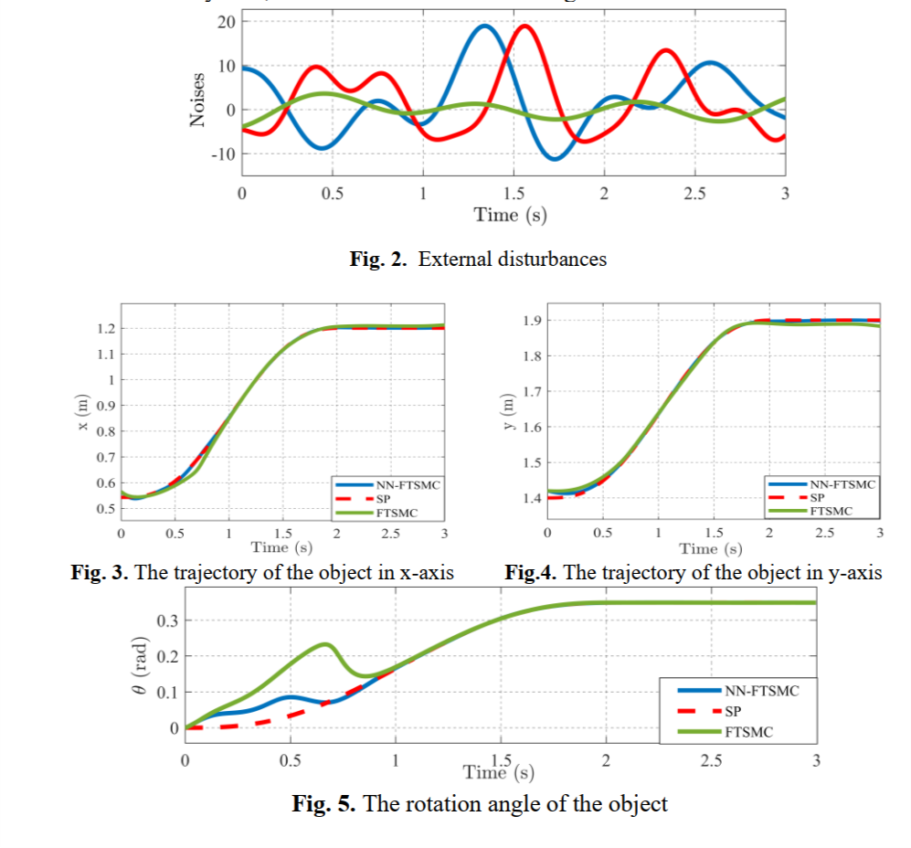
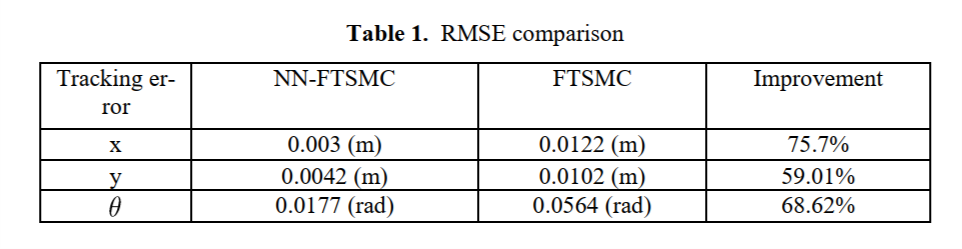

# dual_arm_robot_rbf_terminal_smc

## Introduction

This resource provides MATLAB/Simulink files for the implementation of an adaptive fuzzy sliding mode controller to control a tower crane system and track reference trajectories while eliminating payload oscillation. For more theoretical details, please refer to our paper ["A Neural Network-Based Fast Terminal Sliding Mode Controller for Dual-Arm Robots"](https://doi.org/10.1007/978-3-031-22200-9_5)

## Results

